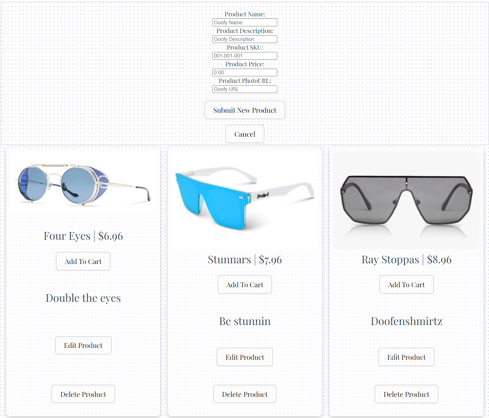

## 3D Glasses

Live Demo: [urlhere](urlhere)

3D Glasses is an e-commerce site for users to request custom, 3D printed solutions for all their eyewear needs. This was a group project built over 3 weeks during Fullstack academy's 2211 cohort and is intended to showcase a minimum viable product for an e-commerce web app.

## Table of Contents

- [3D Glasses](#project-name)
    - [Table of Contents](#table-of-contents)
    - [General Information](#general-information)
    - [Technologies Used](#technologies-used)
    - [Features](#features)
    - [Screenshots](#screenshots)
    - [Project Status](#project-status)
    - [Room for Improvement](#room-for-improvement)
    - [Acknowledgements](#acknowledgements)
    - [Contact](#contact)
    - [License](#license)

## General Information

We built this site first and foremost with security in mind. Utilizing JWT and bcrypt, user passwords are hashed before being stored on our server, ensuring that they are the only user that has access to their information (such as order history and personal contact information) and only they may add, edit, or remove items from their cart.

## Technologies Used

-HTML
-CSS
-Javascript
-Express
-Node
-React
-React Router
-PostgreSQL
-JWT
-Bcrypt

## Features

All users are able to:
- View and search for different styles of glasses frames.
- Add, remove, and edit items in a persistent individual cart.
Administrators are able to:
- View a list of all users in order to verify order information.
- Add, edit, or remove product listings from the website.

## Screenshots

### Sign up for a new account:

### Manipulate User Cart:

### Edit Available Products:

## Project Status

Project may be worked on intermittently due to group members moving on to new projects.

## Room for Improvement

- Improve UI/UX
- Integrate Stripe for better checkout experience
- Add user email confirmation on signup and successful purchase
- Make the site ADA compliant
- Add product categories
- Expand product search functionality
- Persist the header at the top of the page for easier navigation

## Acknowledgements

- This project was built during FullStack Academy's Capstone Project for the 2211 Fulltime Web Development course.
- A big thank you to our mentor for this project, [Steven Hulse](steven's github page).

## Contact

Created by [Spencer Hurd](https://github.com/spencer-hurd), [Delores Curtis](https://github.com/trese19), [Trenton Toplikar](https://github.com/TrentonToplikar), and [Tyler Gunlock](https://github.com/Gunny434).

Feel free to contact us if you have any questions.

## License

License information goes here?